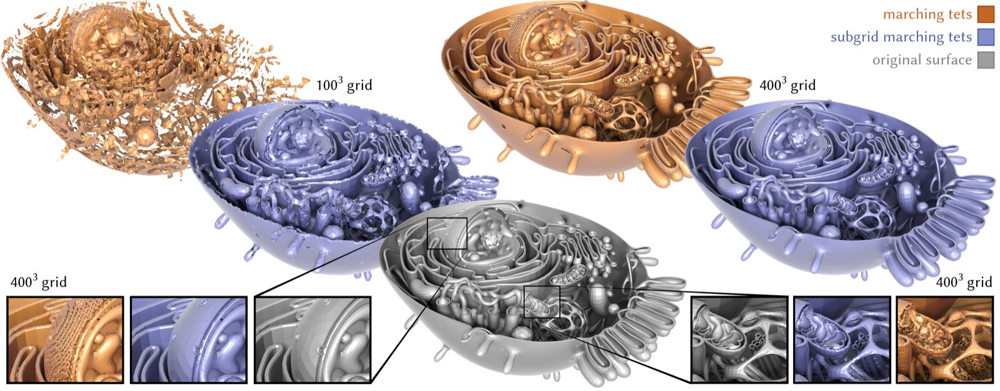

# Subgrid Marching Tetrahedra

Implementation of [**Subgrid Marching Tetrahedra**](https://hbaktash.github.io/projects/subgrid-marching-tetrahedra/index.html), 
a method for extracting intersection-free isosurfaces using intersections with a tetrahedral grid's edges.




The two primary executables are:

| Executable | Description |
|------------|-------------|
| `subgrid` | Primal extraction — outputs a triangle soup / manifold mesh |
| `dualSubgrid` | Dual extraction — outputs a dual polygon mesh via QEF solve |

An interactive single-tetrahedron visualizer is included as `singleTetSubgrid` -- and another UI for a set of four tets sharing an edge in `ringTetSubgrid`.

## Quick examples

The executables `subgrid` and `dualSubgrid` accept three input types and write the
result to exactly the `-o` path you give. Run these from the repo root after
[building](#building):

```sh
# 1. Triangle mesh, remeshed on a 64³ grid
./build/subgrid -i ./data/meshes/spot.obj -r 64 -o ./out/spot.obj

# 2. Contouring an analytical SDF (see deps/sdf-dataset)
./build/subgrid -s Sphere -r 64 -o ./out/sphere.obj

# 3. Precomputed edge intersections (.npz): explicit tet mesh + its edge intersections
./build/subgrid --npz ./data/npz/wine_glass_N64_explicit.npz -o ./out/explicit.obj
```

A few sample inputs are in `data/`; mesh (`meshes/*.obj`) and `.npz` (precomputed edge intersection) examples.

Swap `subgrid` → `dualSubgrid` for the dual (QEF) mesh from any of these inputs. 
See [Usage](#usage) for the full flag reference and [explicit input format](docs/explicit_input_format.md) for the
`.npz` layout.


## Building

### Cloning

```sh
git clone --recursive git@github.com:hbaktash/subgrid-marching.git
cd subgrid-marching
git submodule update --init --recursive
```

All dependencies are either fetched automatically by CMake (via CPM) or exist as submodules.

### C++

The core functionalities are in C++.

```sh
cmake -S . -B build -DCMAKE_BUILD_TYPE=Release
cmake --build build -j
```

All executables land in `build/`. Add `-DSUBGRID_POLYSCOPE_VIEWER=OFF` for a
headless build: it drops the Polyscope / OpenGL / GLFW dependency and builds only
`subgrid`, `dualSubgrid`, and the tests (the interactive demos need the viewer).
`-DSUBGRID_WITH_CGAL=ON` adds the optional exact-arithmetic query handler; see
[Robust queries (CGAL)](#robust-queries-cgal) for the system packages it needs.

### Python

```sh
pip install . 
```

```python
import subgrid_marching as smt

result = smt.primal_from_mesh_file("data/meshes/spot.obj", resolution=64)
result.vertices       # (N, 3) float64
result.faces          # list of index arrays (faces are n-gons)
result.non_even_tets  # 0 on a watertight input
```

Per-tet constructions and the full pipelines are exposed in Python via python bindings. see
[`python/README.md`](python/README.md) for the API and
[`python/examples/`](python/examples/) for  examples.

### Just want the algorithm? (no build, no dependencies)

If you only need the **per-tet** primal/dual local constructions and don't want
to build this project at all, use the copy-pasteable ports in
[`standalone/`](standalone/): a single header-only C++ file (STL only) or a
single pure-Python file. See [`standalone/README.md`](standalone/README.md).

## Usage

Both `subgrid` and `dualSubgrid` take a single input, supplied in one of three
forms (pick exactly one):

- a triangle mesh file (`-i`),
- a named built-in SDF (`-s`) — run either executable with `--listSDFs` to print the available names, or
- a precomputed `.npz` of edge intersections (`--npz`).

See [explicit input format](docs/explicit_input_format.md) for the full spec of the `.npz` format and
[`data/npz/`](data/npz/) for examples.

For more details about each pipeline see the
[construction policy](docs/construction_policy.md).

### subgrid — primal extraction

```
./build/subgrid -i <mesh.obj|ply|off>  -r <resolution>  -o <output.obj>  [options]
./build/subgrid -s <SDF name>          -r <resolution>  -o <output.obj>  [options]
./build/subgrid --npz <hits.npz>                          -o <output.obj>  [options]
```

| Flag | Default | Description |
|------|---------|-------------|
| `-i, --input` | — | Input triangle mesh |
| `-s, --inputSDF` | — | Named built-in SDF, e.g. `Sphere`, `Torus` (ported from [sdf-dataset](https://github.com/GeometryCollective/sdf-dataset)) |
| `--npz` | — | Explicit tet mesh + precomputed edge intersections (`.npz`); `-r` is ignored |
| `-r, --tetGridResolution` | 64 | Grid resolution — builds an n³ cube grid (5n³ tetrahedra) |
| `-o, --output` | — | Output mesh path; if omitted, result is only visualized |
| `--cgal` | off | Use exact CGAL (EPECK) intersections for mesh input; requires `-DSUBGRID_WITH_CGAL=ON` (see [non-even tets](#a-note-on-non-even-open-tets)) |
| `--seed` | 1 | Seed for the fixed input-perturbation offset (mesh input) |

**Vertex merging** is set by two flags: the default is exact **combinatorial**
merge; `--mergeEPS <eps>` (with `eps ≥ 0`) switches to positional **numerical**
merge, and `--noMerge` emits the raw per-tet triangle soup. The trade-offs are in
[vertex merging](docs/combinatorial_merging.md).

An alternative **greedy** primal construction (fan/spiral triangulation of each
boundary curve) is available with `--greedy` -- intersection-free property is not
guaranteed in this mode.

Remaining options (`--mod2`, `--noViz`, `--noPBar`, `--inputSaveDir`) are listed
by `./build/subgrid -h`. The output mesh is written to exactly the `-o` path; the
Polyscope window opens after extraction unless `--noViz` is given.

### dualSubgrid — dual extraction

```
./build/dualSubgrid -i <mesh>  -r <resolution>  -o <output.obj>  [options]
./build/dualSubgrid -s <SDF>   -r <resolution>  -o <output.obj>  [options]
./build/dualSubgrid --npz <hits.npz>              -o <output.obj>  [options]
```

> **Note:** The dual QEF solve needs a normal per intersection, so with `--npz`
> input the `.npz` should include `isect_normals` (see [explicit input format](docs/explicit_input_format.md)).
> If it doesn't, pass `--noNormal` to place each dual vertex at its boundary-polygon
> centroid instead of solving the QEF.


Flags shared with `subgrid` (`-i`, `-s`, `--npz`, `-r`, `-o`, `--mod2`, `--noViz`,
`--noPBar`, `--inputSaveDir`, `--cgal`, `--seed`) behave identically.

Additional flags:

| Flag | Default | Description |
|------|---------|-------------|
| `-a, --alpha` | 0.1 | QEF regularization — higher values pull dual vertices toward the polygon centroid |
| `--pd, --projectDuals` | off | Clip each dual vertex back inside its local grid cell |
| `--noNormal` | off | Skip the QEF solve — place each dual vertex at its boundary-polygon centroid. No normals needed (required for `.npz` inputs without `isect_normals`) |

The dual mesh is written to exactly the `-o` path.

### singleTetSubgrid — interactive visualizer

```sh
./build/singleTetSubgrid [-o output_prefix.obj]
```

Opens a Polyscope GUI for building and visualizing normal surfaces inside a
single tetrahedron. Sliders control normal coordinates (corner and diagonal
cuts) and edge intersection counts directly.

More complex configurations can be visualized with `ringTetSubgrid`, which shows four tets sharing an edge.

## Input preprocessing

When a mesh file is provided, the input is automatically:
1. Welded (vertices with identical positions merged) and triangulated, so that
   "soup" representations of watertight meshes stay watertight.
2. Centered and scaled to fit within 98% of the unit cube `[-1, 1]³`.
3. Rigidly translated by a small fixed-seed offset (magnitude 0.01) to break
   axis-alignment with the grid and avoid degenerate ray/grid coincidences. The
   offset is half the grid-boundary clearance, so the mesh always stays inside
   the grid. Unlike per-vertex jitter, this keeps the mesh geometrically exact.
   The offset direction is drawn from a fixed seed (`--seed`, default `1`), so
   changing it yields a different perturbation.

Use `--inputSaveDir <path>` to save and inspect the preprocessed mesh.

## A note on non-even (open) tets

`subgrid` and `dualSubgrid` report a `non-even tets` count. Each active tetrahedron should
see the isosurface cross its faces an even number of times (the "even-sum"
condition); when it holds, the per-tet boundary curves close up and the output is
watertight and orientable. A non-zero count means some tets had an odd crossing
parity, producing open curves — the output may then have small holes, or have pinch vertices, or be
non-orientable near those tets.

The dominant cause is a **non-watertight input**: meshes with holes/boundaries
will report some non-even tets, and that is expected. A
watertight input (even if self-intersecting) — even one stored as a triangle soup — should report
`non-even tets: 0`. A small residual count on an otherwise-closed mesh usually
reflects near-degenerate ray/grid intersections at that resolution. Quick ways
to reduce it are: (a) slightly changing the resolution `-r`, or (b) changing the
`--seed` to use a different input perturbation.
See below (Robust queries) for a non-quick way.

### Robust queries (CGAL)

For mesh input (`-i`), an exact edge–surface intersection query handler using
[**CGAL's EPECK**](https://doc.cgal.org/latest/Kernel_23/index.html) exact
predicates is available as an optional build. On almost every tested example this
drives the non-even count to zero, at roughly ~5× the intersection-query cost of
the default FCPW handler. It is off by default; without `--cgal` the pipeline is
unchanged.

The CGAL release itself is fetched and version-pinned by CMake (see
[`cmake/cgal.cmake`](cmake/cgal.cmake)), so it does not depend on any
system-installed CGAL. Its exact kernels do require **Boost (≥ 1.72), GMP
(≥ 4.2), and MPFR (≥ 2.2.1)** on the system:

```sh
brew install boost gmp mpfr                            # macOS
sudo apt install libboost-dev libgmp-dev libmpfr-dev   # Debian/Ubuntu
```

Then build with `-DSUBGRID_WITH_CGAL=ON` and pass `--cgal` at runtime:

```sh
cmake -S . -B build -DCMAKE_BUILD_TYPE=Release -DSUBGRID_WITH_CGAL=ON
cmake --build build -j
./build/subgrid -i ./data/meshes/spot.obj -r 64 --cgal -o ./out/spot.obj
```

**From Python**, it is the same build option passed through pip. The published
wheels are built without CGAL, so this requires compiling from a clone:

```sh
CMAKE_ARGS="-DSUBGRID_WITH_CGAL=ON" pip install .
```

```python
smt.primal_from_mesh_file("data/meshes/spot.obj", 64, cgal=True)
```

`cgal=True` applies to mesh input only (`primal_from_mesh`, `primal_from_mesh_file`,
and the `dual_` equivalents); without the CGAL build it raises.

## A note on self-intersections

The output produced by this method—regardless of whether it is closed or orientable—is mathematically guaranteed to be free of self-intersections (see Appendix D in the [paper](https://hbaktash.github.io/projects/subgrid-marching-tetrahedra/index.html)). The per-tet self-intersection tests in `tests/test_self_intersection.cpp` confirm this empirically across thousands of configurations of edge-intersection counts and locations.
If a numerical self-intersection test ever flags the output, it is likely detecting triangles that are *near*-overlapping but not actually overlapping—a false positive rather than a real intersection. How closely such triangles are allowed to approach is governed by the "push-in" epsilon (of Section 3.2.3 from the paper), exposed as the `scoop_bulge` parameter of `SubgridPipelineOpts` (`subgrid_pipeline.h`, default `1e-3`); a small enough `scoop_bulge` guarantees the intersection-free property, while increasing it pushes near-coincident triangles further apart. A principled (non-heuristic) way to choose this value is left to future work.

## Citation

If you use this code in your projects, please cite:

```bibtex
@article{Baktash:2026:SMT,
  author    = {Baktash, Hossein and Gillespie, Mark and Crane, Keenan},
  title     = {Subgrid Marching Tetrahedra},
  journal   = {ACM Trans. Graph.},
  issue_date = {July 2026},
  volume    = {45},
  number    = {4},
  articleno = {57},
  numpages  = {20},
  year      = {2026},
  publisher = {Association for Computing Machinery},
  address   = {New York, NY, USA},
  doi       = {10.1145/3811358},
  url       = {https://doi.org/10.1145/3811358}
}
```

## License

This project is released under the [MIT License](LICENSE).
